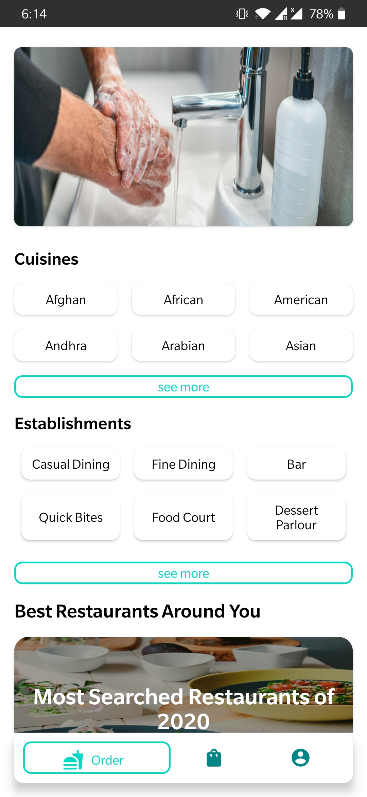

### Hi there 👋, my name is Ashish
#### I am an android developer

**# RestaurantApp** is an android app built using zomato api and firebase with mvvm architecture and coroutines & retrofit.

    
    
   
  
  
  
  
  

  [website](https://ashishsagar.8b.io)  

  
